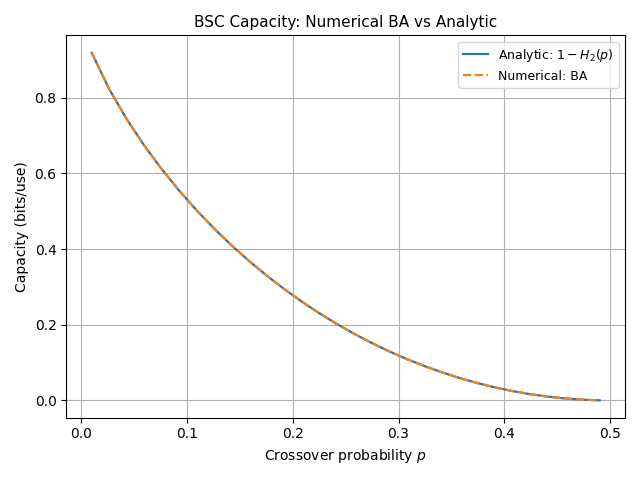
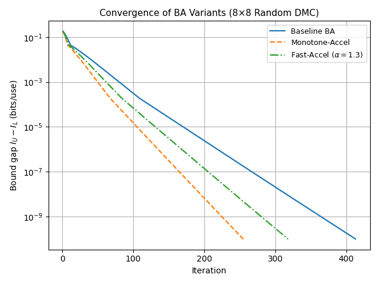
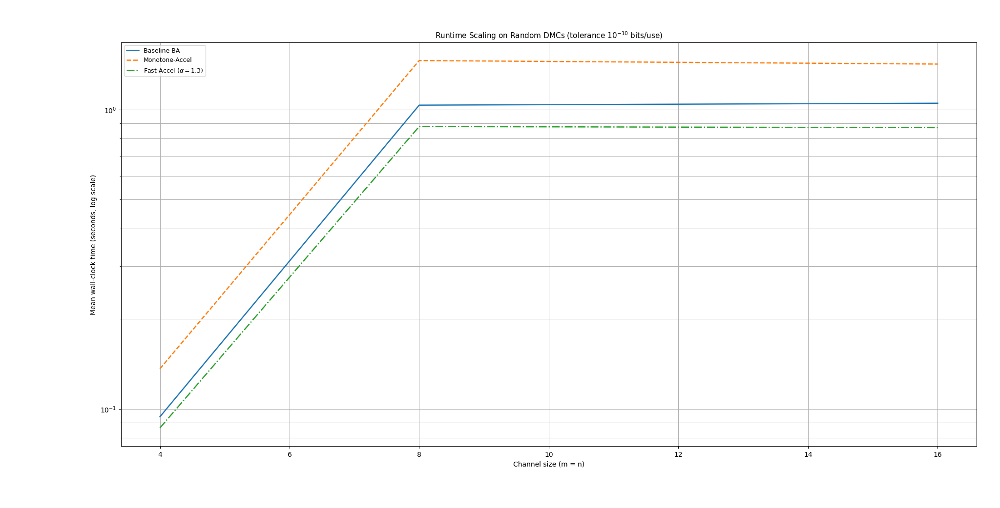
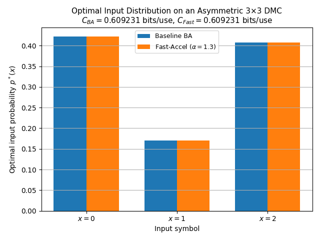

# Accelerated Blahut–Arimoto Capacity Computation

Numerical channel-capacity estimation for discrete memoryless channels, with Python implementations, example experiments, and the accompanying research paper.

**Author:** Amir Rasmi Al-Rashayda · Department of Computer Engineering, Birzeit University

## Overview

Channel capacity is the maximum mutual information over input distributions. This project uses the Blahut–Arimoto (BA) algorithm to estimate capacity from a channel transition matrix and compares it with a parameterized relaxed update.

- Standard BA with a lower/upper bound-gap stopping criterion.
- A relaxed-update variant exposed as `accelerated_ba` in the supplied code.
- Binary symmetric channel (BSC) and binary erasure channel (BEC) examples.
- Original paper, source archive, and four supplied research figures.
- Automated checks against analytic capacities and an asymmetric channel.

## Quick start

Use Python 3.10 or later. From the repository root:

```bash
python -m venv .venv
```

Activate the environment:

```powershell
# Windows PowerShell
.venv\Scripts\Activate.ps1
```

```bash
# macOS / Linux
source .venv/bin/activate
```

Install dependencies and run the examples:

```bash
python -m pip install -r requirements.txt
python Code/experiments.py
```

The script prints capacity, iteration counts, and timings, and opens Matplotlib convergence plots. Close each plot window to continue. In a headless environment, use `MPLBACKEND=Agg` to suppress interactive windows.

## Use the solvers

The source uses sibling-module imports. Run this example from the `Code` directory:

```python
from ba_core import blahut_arimoto
from ba_accelerated import accelerated_ba
from channels import BSC

W = BSC(0.1)
standard = blahut_arimoto(W, tol=1e-8)
relaxed = accelerated_ba(W, alpha=0.7, tol=1e-8)

print(standard["capacity"])  # approximately 0.531004 bits/channel use
print(standard["p"])         # capacity-achieving input distribution
```

`W` has shape `(number_of_inputs, number_of_outputs)`. Each row must contain finite, nonnegative transition probabilities summing to one. The original solvers assume valid inputs; they do not perform explicit input validation.

Both solvers return:

| Key | Meaning | Units |
| --- | --- | --- |
| `capacity` | Last evaluated mutual-information lower bound | bits/channel use |
| `p` | Input distribution | probability |
| `iterations` | Number of bound evaluations | count |
| `gap` | Upper bound minus lower bound | nats/channel use |
| `history` | Evaluated mutual-information lower bounds | bits/channel use |

The stopping tolerance `tol` uses **nats**, because the supplied implementations calculate divergences with natural logarithms. To request a gap of `epsilon_bits`, pass `tol=epsilon_bits * np.log(2)`.

## Paper and implementation scope

[Read the paper](Accelerated%20Blahut-Arimoto%20Capacity%20Computation%20for%20Discrete%20Memoryless%20Channels.pdf) · [Download the original code archive](Code.zip)

The paper discusses a monotone method with backtracking and a fast geometric-extrapolation method with `alpha > 1`. The supplied archive contains a simpler update, proportional to `p * exp(alpha * D)`, with default `alpha=0.7`. At that default it is a damped update; faster convergence is not established by this repository.

The supplied code also returns the lower bound rather than the paper's bound midpoint, and its default tolerance differs from the paper's experimental tolerance. The supplied experiments cover BSC and BEC only. Symmetric examples start at an optimal uniform distribution, so they do not demonstrate acceleration. The paper's random-channel benchmarks and two acceleration strategies are not reproduced by these scripts.

The original PDF, ZIP, and extracted Python files are preserved. Repository documentation, tests, dependency declarations, and CI were added for usability. If the iteration limit is reached before convergence, the original solvers do not raise an error; inspect `gap` before relying on a result. At that limit, the returned `p` can be one update ahead of the reported capacity and gap.

## Validation

```bash
python -m unittest discover -s tests -v
```

Checks cover analytic BSC/BEC capacities, zero-capacity and noiseless channels, asymmetric-channel convergence, probability normalization, and the equivalence of the relaxed update to standard BA when `alpha=1`.

GitHub Actions runs these checks on Python 3.10 and 3.12. Runtime values vary with hardware; the checks do not claim to reproduce the paper's timing results.

## Supplied figures

These images are included from the original archive; they are not generated by `Code/experiments.py`.



| Convergence | Runtime scaling |
| --- | --- |
|  |  |



## Repository layout

```text
Code/
  ba_core.py          Standard BA solver
  ba_accelerated.py   Parameterized relaxed-update solver
  channels.py         BSC and BEC constructors
  experiments.py      Interactive example experiments
  fiu/                Original research figures
tests/                Numerical validation checks
.github/workflows/    Continuous integration
Code.zip              Unmodified source archive
*.pdf                 Original research paper
requirements.txt      Runtime dependencies
CITATION.cff          Citation metadata
```

## Attribution and reuse

Please cite the accompanying paper when referring to this work; citation metadata is available in `CITATION.cff`. No redistribution license was supplied with the original materials, and no new license has been assigned. Contact the author for reuse permission.

For contributions, describe the numerical change, include a reproducible example, and run the validation checks. Changes intended to reproduce the paper should include the benchmark setup and clearly distinguish new results from the supplied figures.
